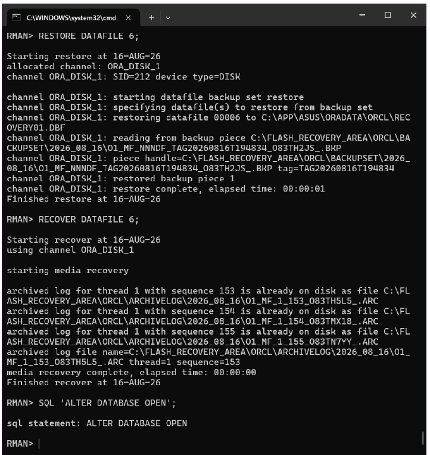

# Oracle 11g RMAN Backup and Disaster Recovery

A practical Oracle Database 11g backup-and-recovery project demonstrating a complete RMAN workflow: ARCHIVELOG configuration, disk backup sets, control-file autobackup, validation, a simulated datafile failure, restore, media recovery, and final data verification.

## Scenario overview

The lab creates a dedicated `RECOVERY_TS` tablespace and an `RMANLAB.ORDERS` test table. After a full database and archived-redo backup, a fourth row is committed. The tablespace datafile is then moved away from its registered location to simulate a real media failure.

Oracle fails to open with `ORA-01157` and `ORA-01110`. RMAN restores datafile 6 from backup, applies archived redo, opens the database, and recovers all four rows—including the post-backup transaction.

## Technical highlights

- Enabled `ARCHIVELOG` mode and verified the Fast Recovery Area.
- Configured disk `BACKUPSET` output and control-file autobackup.
- Applied a seven-day recovery-window retention policy.
- Executed `BACKUP DATABASE PLUS ARCHIVELOG` and separate SPFILE/control-file backups.
- Validated recoverability with `RESTORE DATABASE VALIDATE`.
- Forced and captured an actual missing-datafile failure.
- Restored and recovered a single datafile using archived redo.
- Verified transactional consistency after media recovery.

## Recovery workflow

1. Inspect the database, DBID, open mode, log mode, and FRA.
2. Enable ARCHIVELOG mode and restart the database.
3. Create isolated test storage and seed data.
4. Configure RMAN and create validated backups.
5. Commit a post-backup transaction and archive the current redo.
6. Move the test datafile to simulate media loss.
7. Restore and recover datafile 6, then open the database.
8. Query the test table and confirm all four rows are present.

## Repository contents

- [`report/Oracle_11g_Backup_Disaster_Recovery_Public.pdf`](report/Oracle_11g_Backup_Disaster_Recovery_Public.pdf) — complete public portfolio report in Arabic and English.
- [`commands/oracle-lab-setup.sql`](commands/oracle-lab-setup.sql) — safe SQL*Plus setup template with an interactive password prompt.
- [`commands/rman-backup-recovery.rman`](commands/rman-backup-recovery.rman) — reusable RMAN backup, validation, restore, and recovery commands.
- [`evidence/`](evidence/) — selected screenshots showing backup validation, datafile recovery, and final data verification.

## Evidence

- [Backup validation](evidence/01-backup-validation.png)
- [Datafile restore and media recovery](evidence/02-datafile-restore-and-recovery.png)
- [Recovered data verification](evidence/03-final-data-verification.png)

## Safe usage

Run these commands only in an isolated training database. The workflow changes database operating mode, restarts the instance, creates database objects, and intentionally makes a datafile unavailable.

The student ID, document metadata, and lab password were removed from the public report. The course-assignment brief is intentionally excluded.

